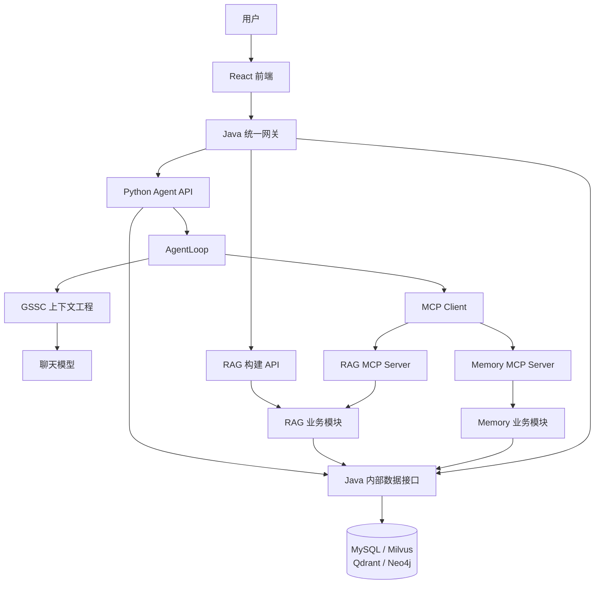

# LearningAssistant 智能体老师

LearningAssistant 是一个面向个人学习场景的智能知识问答系统。用户可以上传自己的教材和
资料，系统将其构建为隔离的 RAG 知识库；智能体结合知识库、长期记忆和当前会话，
完成知识讲解、追问、答案判断与纠正。

项目由三个核心部分组成：

- **Agent（Python）**：负责模型调用、AgentLoop、上下文工程、MCP 工具调用、RAG 与
  Memory 的业务逻辑。
- **Backend（Java）**：负责用户与鉴权、会话归属、运行幂等、事件和聊天记录持久化、
  文件管理以及数据库访问。
- **Frontend（React）**：负责登录、对话、知识库管理、智能体设置和手动上下文压缩。

系统中的“每个用户拥有一个智能体”是逻辑隔离：每个用户拥有独立的配置、知识、
记忆和会话，不为每个用户常驻一个 Python 进程。

## 主要能力

- 用户注册、登录、资料修改和密码管理。
- 多会话聊天，同一用户的会话历史相互独立。
- PDF、Markdown、TXT 等学习资料解析、结构识别、自适应分块与知识库构建。
- 基于 Milvus 向量检索和 Neo4j 图扩展的用户级 RAG 检索。
- Working、Semantic、Episodic 三类记忆；模型决定写入，系统按问题主动召回。
- 基于 MCP 的统一工具发现与调用，RAG 和 Memory 作为共享 MCP 服务运行。
- 原生 Tool Calling、流式 SSE 输出、运行幂等、事件持久化和中断恢复。
- Gather、Select、Structure、Compact 上下文流水线，以及 Archive 和 Session Ledger。
- 达到上下文预算的 92% 时自动 Compact，也支持用户手动 Compact。
- 用户级模型、人设和启用工具配置。

## 系统架构



Java 从登录令牌取得可信的 `user_id`，检查会话归属后再调用 Python。Python 不接收
浏览器自行填写的用户身份，只处理 Java 传入的 `user_id`、`session_id`、
`request_id` 和 `message_id`。Python 需要读写数据时，通过 `Agent/Interface` 调用
Java 内部数据接口，由 Java DataPort 访问数据库。

RAG 建库与聊天相互独立。用户可以在未进入对话时上传文件，Java 负责受控文件路径、
文档状态和任务发起，Python 负责解析、分块和索引构建。聊天中的智能体只通过
`rag_search` 查询已经就绪的知识库；没有可用内容时工具返回空结果，由模型根据自身
知识继续回答并说明依据。

## 数据范围

| 数据 | 隔离范围 | 保存位置与用途 |
|---|---|---|
| 用户和智能体配置 | `user_id` | MySQL；模型、人设和启用工具 |
| 会话与聊天记录 | `user_id + session_id` | MySQL；用户可见的提问、最终回答和工具时间线 |
| Working Memory | `user_id + session_id` | Python 运行时；当前会话的临时状态 |
| Semantic / Episodic Memory | `user_id` | MySQL 正文、Qdrant 索引、Neo4j 关系；跨会话使用 |
| RAG 文档 | `user_id + document_id` | 受控文件空间、Milvus 和 Neo4j；默认跨会话检索 |
| Session Ledger / Compact 摘要 | `user_id + session_id` | MySQL；恢复长会话连续性 |

`session_id` 由 Agent 模块生成，格式为
`session_yyyyMMdd_HHmmss_<user_id>`。查询、更新、删除、图扩展和正文回查都必须带
用户范围，缺少身份时直接拒绝访问。

## 上下文与记忆

每次模型调用前，`ContextBuider` 按以下流程构建上下文：

1. **Gather** 收集系统提示词、工具描述、当前问题、会话历史、相关长期记忆、
   RAG 结果、Ledger 和当前执行链。
2. **Select** 在预算内筛除无关或重复内容，保留系统信息、当前问题、最近五轮问答、
   模型尚未看过的工具结果和当前执行链。
3. **Structure** 将内容组装为 LangChain Message 和原生工具 schema。
4. **Compact** 只在达到 92% 阈值、工具结果无法放入或用户主动要求时调用模型生成
   摘要；摘要保存后替代较早历史，原文仍可通过 Archive 回读。

系统提示词和工具 schema 不参与压缩。已经完成回答的旧执行过程、较早对话和已选入
上下文的旧记忆可以进入摘要；正在执行的思维链和最新未读工具结果必须保留原文。

Memory MCP 对模型提供存储和删除能力，记忆类型由模型给出，再由 Memory 模块路由到
Working、Semantic 或 Episodic Memory。记忆查询由系统在 Gather 阶段主动完成，查询
结果仍经过 Select，避免把全部长期记忆无差别放入上下文。长期记忆被纠正或删除后，
引用旧版本的摘要会失效并回退到有效来源。

## 目录结构

```text
LearningAssistant/
├── Agent/
│   ├── Assistant.py              # 无状态的 LangChain 模型调用器
│   ├── AgentLoop.py              # 智能体主循环编排
│   ├── SystemPrompt.py           # 智能体老师系统提示词
│   ├── Context/                  # GSSC、Compact、数据模型和 ContextBuider
│   ├── Loop/                     # 模型、工具、上下文和终止节点
│   ├── Tools/
│   │   ├── MCP/                  # MCPClient、RAGServer、MemoryServer
│   │   ├── RAG/                  # 文档处理、索引构建、召回和集成层
│   │   └── Memory/               # 三类记忆及统一路由
│   └── Interface/                # Python 与 Java 的 HTTP/SSE 接口
├── backend/
│   ├── DataPort/                 # MySQL、Milvus、Qdrant、Neo4j 数据访问
│   ├── User/                     # 用户、令牌和身份服务
│   └── Interface/                # 内部数据接口、统一网关和 SSE 客户端
├── Fronted/                      # React + TypeScript + Vite 前端
├── deploy/                       # Compose、镜像、初始化和运维脚本
├── docs/                         # 架构与模块设计文档
└── requirements.txt              # Python 依赖
```

各模块保持单一职责：`Tools/RAG` 和 `Tools/Memory` 只实现工具本身，`Tools/MCP` 只处理
MCP 协议与服务暴露，`Agent/Interface` 只处理 Agent 与 Java 之间的通信，数据库访问
统一落在 Java `DataPort`。

## 快速开始

### 环境要求

- Linux 或兼容的 Docker 主机
- Docker Engine 和 Docker Compose Plugin
- 可用的 OpenAI 兼容模型接口
- 可用的 Qdrant Cloud 实例
- 建议至少 8 GiB 内存

统一部署会在容器中构建 Python、Java 21 和前端，不要求宿主机预先安装 Maven、JDK、
Node.js 或 Python 依赖。

### 1. 配置模型

在项目根目录创建 `.env`：

```dotenv
AGENT_MODEL=glm-4.7
AGENT_ALLOWED_MODELS=glm-4.7
AGENT_BASE_URL=https://your-openai-compatible-endpoint/v1
AGENT_API_KEY=replace-with-your-api-key

# 可选：控制设置页可启用的 MCP 工具
AGENT_AVAILABLE_TOOLS=rag__rag_search,memory__memory_store,memory__memory_forget
AGENT_DEFAULT_ENABLED_TOOLS=rag__rag_search,memory__memory_store,memory__memory_forget
```

`AGENT_API_KEY` 只保存在服务端环境中。用户设置仅保存允许范围内的模型名、人设和工具
开关，不保存模型密钥。

### 2. 配置基础设施

```bash
cp deploy/.env.example deploy/.env
```

编辑 `deploy/.env`，至少替换：

- MySQL、MinIO 和 Neo4j 密码；
- `JAVA_INTERNAL_TOKEN`、`PYTHON_INTERNAL_TOKEN` 和 `MCP_INTERNAL_TOKEN`；
- `QDRANT_URL`、`QDRANT_API_KEY` 和 collection 名；
- 对外端口、允许来源和上下文预算（需要调整时）。

embedding 模型、Milvus collection 与 Qdrant collection 的向量维度必须一致。默认
使用 `jinaai/jina-embeddings-v2-base-zh` 和 768 维向量。

### 3. 启动系统

```bash
./deploy/app.sh up
```

启动顺序由 Compose 管理：基础数据库 → Java Storage → MCP 与 RAG Build API →
Python Agent API → Java Gateway → Nginx/Frontend。所有服务就绪后访问：

```text
http://127.0.0.1:8088
```

浏览器统一访问 `/api/*`，由 Nginx 转发到 Java 网关；Python 内部接口和数据库服务
不直接暴露给浏览器。首次进入系统后，按“注册 → 上传资料 → 等待文档就绪 → 新建会话”
的顺序即可开始使用。

MySQL 初始化脚本只在全新的数据卷上执行。开发阶段若数据库卷来自旧表结构，应按项目
的开发数据可删除约定重建开发卷，再重新启动；`./deploy/app.sh down` 默认保留数据卷。

## 常用运维命令

```bash
# 查看应用级健康状态
./deploy/app.sh health

# 查看容器状态
./deploy/app.sh status

# 查看全部日志，或只查看指定服务
./deploy/app.sh logs
./deploy/app.sh logs agent-api java-gateway

# 重启、停止或移除应用容器
./deploy/app.sh restart
./deploy/app.sh stop
./deploy/app.sh down
```

各服务同时提供：

| 端点 | 含义 |
|---|---|
| `GET /health/live` | 进程正在响应 |
| `GET /health/ready` | 服务及必要依赖可以处理请求 |

统一入口的 readiness 会沿调用链检查 Java、Python、MCP 和数据服务。详细部署参数、
资源要求和故障定位见 [部署说明](deploy/README.md)。

## 对外接口概览

浏览器只调用 Java 统一网关。除注册和登录外，接口都需要
`Authorization: Bearer <token>`。

| 接口 | 用途 |
|---|---|
| `POST /auth/register`、`POST /auth/login` | 注册和登录 |
| `GET /auth/me`、`PATCH /users/me` | 当前用户资料 |
| `GET/POST /sessions` | 会话列表与创建 |
| `GET /sessions/{id}/messages` | 读取用户可见的会话记录 |
| `POST /sessions/{id}/runs` | 提交消息并接收 SSE 事件流 |
| `POST /sessions/{id}/compact` | 手动压缩当前会话上下文 |
| `GET/POST /documents` | 文档列表与上传 |
| `PUT /documents/{id}` | 替换原文件并沿用文档 ID 重建 |
| `POST /documents/{id}/rebuild` | 使用已保存原文件重建索引 |
| `DELETE /documents/{id}` | 删除文档、索引和受控文件 |
| `GET/PUT /agent/settings` | 读取或修改当前用户的智能体配置 |

`POST /sessions/{id}/runs` 请求包含稳定的 `request_id`、`message_id` 和用户消息。
相同请求重复提交不会再次执行工具：完成的请求回放已保存事件，执行中的请求返回运行
状态。连接中断会保留已产生的事件和可能已经发生的工具操作，不自动重试写工具。

完整接口契约和内部服务说明见 [Backend Interface 文档](backend/Interface/README.md)。

## 设计文档

- [系统总体实施方案](docs/agent-system-implementation-plan.md)
- [上下文管理系统设计](docs/智能体上下文管理系统设计方案.md)
- [AgentLoop 编排设计](docs/AgentLoop编排设计方案.md)
- [智能体老师系统提示词](docs/智能体老师系统提示词设计.md)
- [RAG 异构文档解析与分块方案](docs/RAG异构文档解析与分块方案.md)
- [DataPort 存储边界](backend/DataPort/README.md)
- [部署与运行](deploy/README.md)

## 当前边界

- 当前部署按每个服务单实例运行，不包含多节点调度、分布式锁和任务队列集群。
- 用户不能自行安装任意 MCP 服务；可用工具由服务端白名单和用户设置共同决定。
- RAG 文档、聊天记录和长期记忆分别通过各自的数据接口管理，
  `memory_forget` 只删除长期记忆。
- 默认使用 Qdrant Cloud；本地基础设施仍包括 MySQL、Milvus、Neo4j、etcd 和 MinIO。
